# Implementare microservizi su AWS

- Data di pubblicazione: Settembre 2020
- Basato su: [Implementing Microservices on AWS](https://docs.aws.amazon.com/it_it/whitepapers/latest/microservices-on-aws/introduction.html)

 

----------

 

## Indice

- [Abstract](#Abstract)
- [Introduzione](#Introduzione)
- [Architettura semplice a microservizi su AWS](#Architettura-semplice-a-microservizi-su-AWS)
- [Semplificare la gestione delle operations](#Semplificare-la-gestione-delle-operations)
- [Componenti di sistemi distribuiti](#Componenti-di-sistemi-distribuiti)
- [Conclusione](#Conclusione)
- [Risorse](#Risorse)

 

----------

 

## Abstract

I microservizi rappresentano un approccio architettonico e organizzativo allo sviluppo del software per accelerare i cicli di implementazione, favorire l'innovazione e la proprietà, migliorare la manutenibilità e la scalabilità delle applicazioni software e scalare le organizzazioni che forniscono software e servizi utilizzando un approccio agile che aiuta squadre di lavorare indipendentemente l'uno dall'altro. Utilizzando un approccio microservizi, il software è composto da piccoli servizi che comunicano su API ben definite che possono essere distribuite in modo indipendente. Questi servizi sono di proprietà di piccoli team autonomi. Questo approccio agile è fondamentale per scalare con successo la tua organizzazione.

Ci sono tre modelli comuni che osserviamo quando i nostri clienti costruiscono microservizi: **basata su API** (*Api-driven*), **basata ad eventi** (*event-driven*) e streaming di dati. In questo whitepaper, introduciamo tutti e tre gli approcci e riassumiamo le caratteristiche comuni dei microservizi, discutiamo delle principali sfide legate alla creazione di microservizi e descriviamo come i team di prodotto possono sfruttare Amazon Web Services (AWS) per superare queste sfide.

 

----------

 

## Introduzione

Le architetture di microservizi non sono un approccio completamente nuovo all'ingegneria del software, ma piuttosto una combinazione di vari concetti di successo e comprovati come:

- Sviluppo software agile
- Architetture orientate ai servizi
- Progettazione API-first
- Integrazione continua/Consegna continua (CI/CD, *continuous integration, continuous delivery*)

In molti casi, i modelli di progettazione della [Twelve-Factor App](https://12factor.net/) vengono sfruttati per i microservizi.

Descriviamo innanzitutto diversi aspetti di un'architettura di microservizi altamente scalabile e a tolleranza d'errore (interfaccia utente, implementazione di microservizi e data store) e come costruirla su AWS sfruttando le tecnologie container. Consigliamo quindi i servizi AWS per implementare una tipica architettura di microservizi senza server al fine di ridurre la complessità operativa.

Serverless è definito come modello operativo dai seguenti principi:

- Nessuna infrastruttura da eseguire il provisioning o la gestione
- Ridimensionamento automatico in base all'unità di consumo
- Modello di fatturazione *"pay for value"*
- Disponibilità integrata e tolleranza di errore

Infine, esaminiamo il sistema generale e discutiamo gli aspetti cross-service di un'architettura di microservizi, come il monitoraggio e il controllo distribuiti, la coerenza dei dati e la comunicazione asincrona.

 

----------

 

## Architettura semplice a microservizi su AWS

Le tipiche applicazioni monolitiche vengono create utilizzando livelli diversi: un livello di interfaccia utente (UI), un livello aziendale e un livello di persistenza. Un'idea centrale di un'architettura di microservizi è quella di suddividere le funzionalità in «verticali» coesivi, non tramite livelli tecnologici, ma implementando un dominio specifico. La Figura 1 illustra un'architettura di riferimento per un'applicazione tipica di microservizi su AWS.

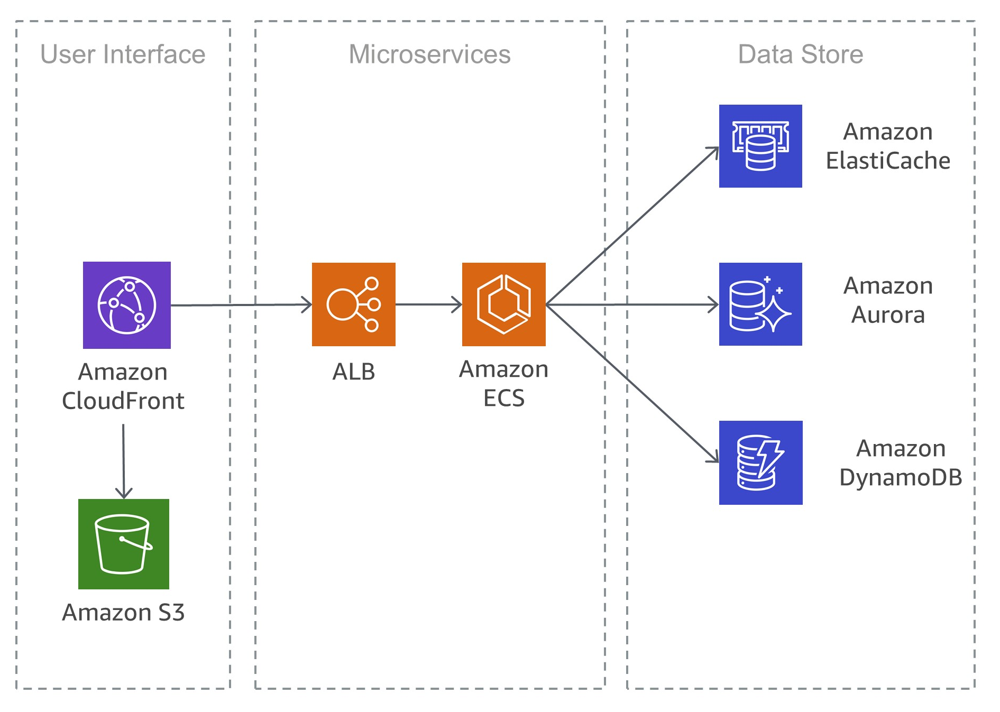

### Interfaccia Utente

Le applicazioni Web moderne utilizzano spesso framework JavaScript per implementare un'applicazione a pagina singola che comunica con un'API REST (*Representational State Transfer*) o RESTful. I contenuti web statici possono essere forniti utilizzando Amazon Simple Storage Service ([Amazon S3](https://aws.amazon.com/it/s3/)) e [Amazon CloudFront](https://aws.amazon.com/it/cloudfront/).

Poiché i client di un microservizio vengono serviti dalla posizione perimetrale più vicina e ricevono risposte da una cache o da un server proxy con connessioni ottimizzate all'origine, le latenze possono essere notevolmente ridotte. Tuttavia, i microservizi in esecuzione uno vicino all'altro non beneficiano di una rete CDN (*Content Delivery Network*). In alcuni casi, questo approccio potrebbe effettivamente aggiungere latenza aggiuntiva. Una procedura consigliata consiste nell'implementare altri meccanismi di memorizzazione nella cache per ridurre la chiacchierata e ridurre al minimo le latenze.

### Microservizi

Spesso diciamo che le API sono l'ingresso principale al mondo dei microservizi. Con questo, intendiamo che le API fungono da punto di ingresso per la logica delle applicazioni dietro un set di interfacce programmatiche, in genere un'API di servizi Web RESTful. Questa API accetta ed elabora le chiamate dai client e potrebbe implementare funzionalità quali la gestione del traffico, il filtraggio delle richieste, il routing, la memorizzazione nella cache, l'autenticazione e l'autorizzazione.

#### Implementare i Microservizi 

AWS ha integrato elementi costitutivi che supportano lo sviluppo di microservizi. Due approcci popolari utilizzano i contenitori [AWS Lambda](https://aws.amazon.com/it/lambda/) e [Docker](https://www.docker.com/) con [AWS Fargate](https://aws.amazon.com/it/fargate/).

Con AWS Lambda, è sufficiente caricare il codice e lasciare che Lambda si occupi di tutto il necessario per eseguire e scalare l'esecuzione per soddisfare la curva della domanda effettiva con alta disponibilità. Ciò significa che non è necessaria alcuna amministrazione delle infrastrutture. Lambda supporta diversi linguaggi di programmazione e può essere attivato da altri servizi AWS o essere chiamato direttamente da qualsiasi applicazione web o mobile. Uno dei maggiori vantaggi di AWS Lambda è che puoi muoverti rapidamente: puoi concentrarti sulla tua logica aziendale perché la sicurezza e il ridimensionamento sono gestiti da AWS. L'approccio opinionato di Lambda guida la piattaforma scalabile.

Un approccio comune per ridurre gli sforzi operativi per la distribuzione è la distribuzione basata su container. Le tecnologie dei container come Docker sono aumentate in popolarità negli ultimi anni a causa di vantaggi quali portabilità, produttività ed efficienza. La curva di apprendimento con i contenitori può essere ripida e devi pensare alle correzioni di sicurezza per le tue immagini Docker e il monitoraggio. [Amazon Elastic Container Service (Amazon ECS)](https://aws.amazon.com/it/ecs/) e [Amazon Elastic Kubernetes Service (Amazon EKS)](https://aws.amazon.com/it/eks/) eliminano la necessità di installare, gestire e scalare la propria infrastruttura di gestione del cluster. Con semplici chiamate API, puoi avviare e arrestare le applicazioni abilitate per Docker, interrogare lo stato completo del cluster e accedere a molte funzionalità familiari come gruppi di sicurezza, bilanciamento del carico, volumi [Amazon Elastic Block Store (Amazon EBS)](https://aws.amazon.com/it/ebs/) e ruoli [AWS Identity and Access Management (IAM)](https://aws.amazon.com/it/iam/).

AWS Fargate è un servizio di gestione dei contenitori che consente di eseguire contenitori senza server in modo da non doversi preoccupare del provisioning, della configurazione e del ridimensionamento dei cluster di macchine virtuali per l'esecuzione dei contenitori. Con Fargate non dovrete più preoccuparvi del provisioning di risorse di calcolo sufficienti per le applicazioni container. Fargate può lanciare decine di migliaia di container e scalare facilmente per eseguire le applicazioni mission-critical.

Amazon ECS supporta strategie e vincoli di posizionamento dei container per personalizzare il modo in cui Amazon ECS posiziona e termina le attività. Un vincolo di posizionamento delle attività è una regola che viene considerata durante il posizionamento delle attività. È possibile associare attributi, essenzialmente coppie chiave-valore, alle istanze del contenitore e quindi utilizzare un vincolo per posizionare le attività in base a questi attributi. Ad esempio, è possibile utilizzare i vincoli per posizionare determinati microservizi in base al tipo di istanza o alla capacità di istanza, ad esempio le istanze basate su GPU.

Amazon EKS gestisce versioni aggiornate del software Kubernetes open-source, in modo da poter utilizzare tutti i plugin e gli strumenti esistenti della comunità Kubernetes. Le applicazioni in esecuzione su Amazon EKS sono completamente compatibili con le applicazioni in esecuzione in qualsiasi ambiente Kubernetes standard, sia in esecuzione in data center locali che in cloud pubblici. Amazon EKS integra IAM con Kubernetes, consentendo di registrare le entità IAM con il sistema di autenticazione nativo in Kubernetes. Non è necessario impostare manualmente le credenziali per l'autenticazione con i master Kubernetes. L'integrazione IAM consente di utilizzare IAM per autenticarsi direttamente con il master stesso, fornendo un accesso granulare fine all'endpoint pubblico dei master Kubernetes.

Le immagini Docker utilizzate in Amazon ECS e Amazon EKS possono essere memorizzate nel [Amazon Elastic Container Registry (Amazon ECR)](https://aws.amazon.com/it/ecr/). Amazon ECR elimina la necessità di gestire e scalare l'infrastruttura necessaria per alimentare il registro dei container.

Implementare la *Continuous Integration* e *Continuous Delivery* (CI/CD) è una best practice e una parte fondamentale di un'iniziativa DevOps che consente rapidi cambiamenti software mantenendo la stabilità e la sicurezza del sistema. Tuttavia, questo non rientra nell'ambito di questo white paper, ulteriori informazioni possono essere trovate nel white paper "Practicing Continuous Integration and Continuous Delivery on AWS".

#### Private Links

[AWS PrivateLink](https://aws.amazon.com/it/privatelink/) è una tecnologia scalabile e altamente disponibile che consente di connettere privatamente un [Amazon Virtual Private Cloud (Amazon VPC)](https://aws.amazon.com/it/vpc/) ai servizi AWS supportati, ai servizi ospitati da altri account AWS (servizi endpoint VPC) e ai servizi partner AWS Marketplace supportati. Non è necessario un gateway Internet, un dispositivo NAT, un indirizzo IP pubblico, una connessione [AWS Direct Connect](https://aws.amazon.com/it/directconnect/) o una connessione [AWS VPN](https://aws.amazon.com/it/vpn/) per comunicare con il servizio. Il traffico tra il VPC e il servizio non esce dalla rete Amazon.

I collegamenti privati sono un ottimo modo per aumentare l'isolamento delle architetture di microservizi, ad esempio, è possibile creare centinaia di VPC, ciascuno hosting e fornire un singolo microservizio. Le aziende possono ora creare servizi e offrirli in vendita ad altri clienti AWS, per l'accesso tramite una connessione privata. Creano un servizio che accetta il traffico TCP, lo ospitano dietro un Network Load Balancer e quindi rendono disponibile il servizio, direttamente o in AWS Marketplace. Saranno avvisati delle nuove richieste di abbonamento e potranno scegliere di accettarle o rifiutarle. Mentre la potenza di AWS PrivateLink ha meriti in qualsiasi numero di scenari, è di particolare interesse per le organizzazioni SaaS. Attraverso AWS PrivateLink, i provider SaaS vedono nuove e creative opportunità di utilizzare questo costrutto di rete per migliorare ed espandere i modelli architettonici e aziendali delle loro soluzioni.

### Storage dei dati

L'archivio dati viene utilizzato per mantenere i dati necessari per i microservizi. Gli archivi più diffusi per i dati di sessione sono cache in memoria come Memcached o Redis. AWS offre entrambe le tecnologie come parte del servizio gestito [Amazon Elasticache](https://aws.amazon.com/it/elasticache/).

L'inserimento di una cache tra i server applicazioni e un database è un meccanismo comune per ridurre il carico di lettura sul database, che, a sua volta, può consentire l'utilizzo di risorse per supportare più scritture. Le cache possono anche migliorare la latenza.

I database relazionali sono ancora molto popolari per archiviare dati strutturati e oggetti di business. AWS offre sei motori di database (Microsoft SQL Server, Oracle, MySQL, MariaDB, PostgreSQL e [Amazon Aurora](https://aws.amazon.com/it/rds/aurora/)) come servizi gestiti tramite [Amazon Relational Database Service (Amazon RDS)](https://aws.amazon.com/it/rds/).

I database relazionali, tuttavia, non sono progettati per una scala infinita, il che può rendere difficile e dispendioso l'applicazione di tecniche per supportare un numero elevato di query.

I database NoSQL sono stati progettati per favorire scalabilità, prestazioni e disponibilità rispetto alla coerenza dei database relazionali. Un elemento importante dei database NoSQL è che in genere non applicano uno schema rigoroso. I dati vengono distribuiti su partizioni che possono essere scalate orizzontalmente e recuperate utilizzando chiavi di partizione.

Poiché i singoli microservizi sono progettati per fare una cosa bene, in genere hanno un modello di dati semplificato che potrebbe essere adatto alla persistenza NoSQL. È importante capire che i database NoSQL hanno modelli di accesso diversi rispetto ai database relazionali. Ad esempio, non è possibile unire le tabelle. Se ciò è necessario, la logica deve essere implementata nell'applicazione. Puoi utilizzare [Amazon DynamoDB](https://aws.amazon.com/it/dynamodb/) per creare una tabella di database in grado di memorizzare e recuperare qualsiasi quantità di dati e servire qualsiasi livello di traffico delle richieste. DynamoDB offre prestazioni in millisecondi a una cifra, tuttavia, ci sono alcuni casi d'uso che richiedono tempi di risposta in microsecondi. [DynamoDB Accelerator (DAX)](https://aws.amazon.com/it/dynamodb/dax/) fornisce funzionalità di memorizzazione nella cache per l'accesso ai dati.

DynamoDB offre anche una funzione di ridimensionamento automatico per regolare dinamicamente la capacità di throughput in risposta al traffico effettivo. Tuttavia, ci sono casi in cui la pianificazione della capacità è difficile o non è possibile a causa di grandi picchi di attività di breve durata nell'applicazione. Per tali situazioni, DynamoDB fornisce un'opzione on-demand, che offre semplici prezzi pay-per-request. DynamoDB on-demand è in grado di soddisfare istantaneamente migliaia di richieste al secondo senza pianificazione della capacità.

 

----------

 

## Semplificare la gestione delle operations

L'architettura che abbiamo descritto utilizza già i servizi gestiti, ma dobbiamo comunque gestire le istanze di [Amazon Elastic Compute Cloud (Amazon EC2)](https://aws.amazon.com/it/ec2/). Possiamo ridurre ulteriormente gli sforzi operativi necessari per l'esecuzione, la manutenzione e il monitoraggio dei microservizi utilizzando un'architettura completamente serverless.

### Implementare l'API

L'architettura, la distribuzione, il monitoraggio, il miglioramento continuo e la manutenzione di un'API possono essere un'attività che richiede molto tempo. A volte è necessario eseguire diverse versioni di API per garantire la compatibilità con le versioni precedenti per tutti i client. Le diverse fasi del ciclo di sviluppo (ad esempio, sviluppo, test e produzione) moltiplicano ulteriormente gli sforzi operativi.

L'autorizzazione è una funzionalità critica per tutte le API, ma di solito è complessa da compilare e comporta un lavoro ripetitivo. Quando un'API viene pubblicata e diventa efficace, la prossima sfida consiste nel gestire, monitorare e monetizzare l'ecosistema di sviluppatori di terze parti che utilizzano le API.

Altre caratteristiche e sfide importanti includono la limitazione delle richieste per proteggere i servizi back-end, la memorizzazione nella cache delle risposte API, la gestione della trasformazione delle richieste e delle risposte e la generazione di definizioni e documentazione API con strumenti come Swagger.

[Amazon API Gateway](https://aws.amazon.com/it/api-gateway/) risolve queste sfide e riduce la complessità operativa della creazione e della manutenzione delle API RESTful.

API Gateway consente di creare le API a livello di programmazione importando le definizioni di Swagger, utilizzando l'API AWS o AWS Management Console. API Gateway funge da porta principale a qualsiasi applicazione Web in esecuzione su Amazon EC2, Amazon ECS, AWS Lambda o in qualsiasi ambiente locale. Fondamentalmente, API Gateway consente di eseguire API senza dover gestire i server.

Nella figura seguente, viene illustrato il modo in cui Gateway API gestisce le chiamate API e interagisce con altri componenti. Le richieste da dispositivi mobili, siti Web o altri servizi back-end vengono instradate al punto PoP (CloudFront Point of Presence) più vicino per ridurre al minimo la latenza e fornire un'esperienza utente ottimale.

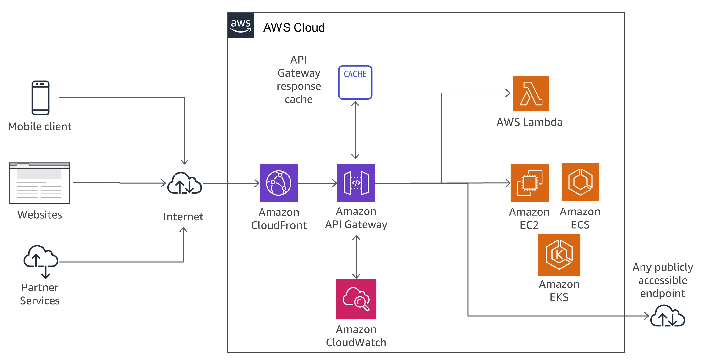

### Microservizi in Serverless

> Nessun server è più facile da gestire di nessun server.

Eliminare i server è un ottimo modo per eliminare la complessità della gestione dei server.

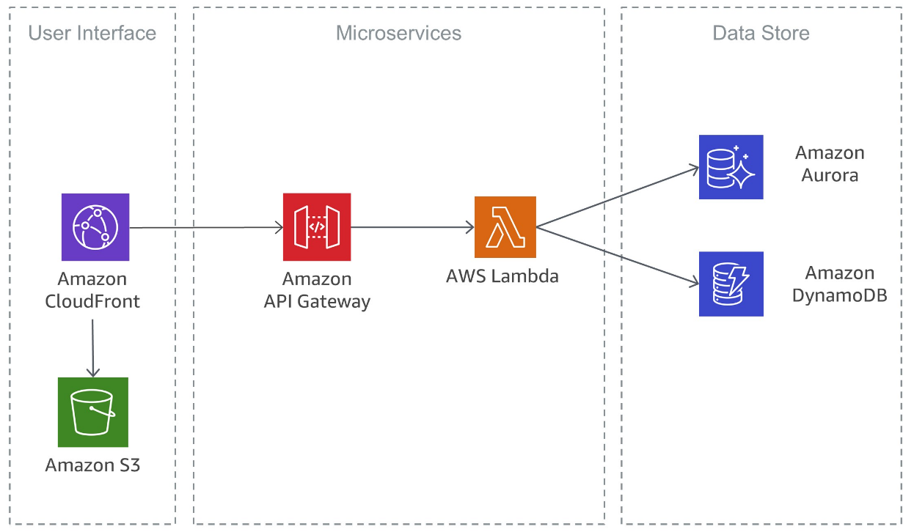

Lambda è fortemente integrato con API Gateway. La possibilità di effettuare chiamate sincrone da API Gateway a Lambda consente la creazione di applicazioni completamente serverless ed è descritta in dettaglio nella nostra documentazione.

La Figura  mostra l'architettura di un microservizio serverless con AWS Lambda in cui il servizio completo è costituito da servizi gestiti, che elimina il carico architettonico per la progettazione di scalabilità e disponibilità elevata ed elimina gli sforzi operativi di esecuzione e monitoraggio del infrastruttura sottostante.

Nella Figura 4 viene illustrata un'implementazione simile basata anche su servizi senza server. In questa architettura, i contenitori Docker vengono utilizzati con AWS Fargate, quindi non è necessario preoccuparsi dell'infrastruttura sottostante. Oltre ad Amazon DynamoDB, viene utilizzato [Amazon Aurora Serverless](https://aws.amazon.com/it/rds/aurora/serverless/), che è una configurazione a scalabilità automatica su richiesta per Amazon Aurora (edizione compatibile con MySQL), in cui il database verrà avviato, chiuso e ridimensionato automaticamente la capacità in base alle esigenze dell'applicazione.

### Distribuire applicazioni basate su AWS Lambda

È possibile utilizzare [AWS CloudFormation](https://aws.amazon.com/it/cloudformation/) per definire, distribuire e configurare applicazioni senza server.

[AWS Serverless Application Model (AWS SAM)](https://github.com/aws/serverless-application-model) è un modo conveniente per definire applicazioni senza server. AWS SAM è supportato nativamente da CloudFormation e definisce una sintassi semplificata per l'espressione di risorse serverless. Per distribuire l'applicazione, è sufficiente specificare le risorse necessarie come parte dell'applicazione, insieme ai criteri di autorizzazione associati in un modello CloudFormation, creare il pacchetto degli artifact di distribuzione e distribuire il modello. Basato su AWS SAM, SAM Local è uno strumento CLI AWS che fornisce un ambiente per sviluppare, testare e analizzare le applicazioni serverless localmente prima di caricarle nel runtime Lambda. È possibile utilizzare SAM Local per creare un ambiente di test locale che simula l'ambiente runtime AWS.

 

----------

 

## Componenti di sistemi distribuiti

Dopo aver esaminato come AWS può risolvere le sfide relative ai singoli microservizi, ora vogliamo concentrarci sulle sfide cross-service, come l'individuazione dei servizi, la coerenza dei dati, la comunicazione asincrona e il monitoraggio e il controllo distribuiti.

### Service Discovery

Una delle principali sfide delle architetture di microservizi consiste nel consentire ai servizi di scoprire e interagire tra loro. Le caratteristiche distribuite delle architetture di microservizi non solo rendono più difficile la comunicazione dei servizi, ma presentano anche altre sfide, come il controllo dello stato di salute di tali sistemi e l'annuncio della disponibilità di nuove applicazioni. È inoltre necessario decidere come e dove archiviare le informazioni sui meta-store, ad esempio i dati di configurazione, che possono essere utilizzate dalle applicazioni. In questa sezione vengono esaminate diverse tecniche per eseguire l'individuazione dei servizi in AWS per architetture basate su microservizi.

#### Individuazione dei servizi basata su DNS

Amazon ECS ora include il rilevamento dei servizi integrato che semplifica l'individuazione e la connessione tra i servizi containerizzati. In precedenza, per garantire che i servizi fossero in grado di individuare e connettersi tra loro, era necessario configurare ed eseguire il proprio sistema di individuazione dei servizi basato su [Amazon Route 53](https://aws.amazon.com/it/route53/), AWS Lambda ed ECS Event Stream oppure collegare ogni servizio a un servizio di bilanciamento del carico.

Amazon ECS crea e gestisce un registro di nomi di servizio utilizzando l'API Route 53 Auto Naming. I nomi vengono mappati automaticamente a un set di record DNS in modo che sia possibile fare riferimento a un servizio per nome nel codice e scrivere query DNS in modo che il nome venga risolto nell'endpoint del servizio in fase di runtime. Puoi specificare le condizioni di controllo dello stato nella definizione delle attività di un servizio e Amazon ECS garantisce che solo gli endpoint di servizio integri vengano restituiti da una ricerca del servizio.

Inoltre, è possibile sfruttare l'individuazione unificata dei servizi per i servizi gestiti da Kubernetes. Per abilitare questa integrazione, AWS ha contribuito al progetto External DNS, un progetto di incubatore Kubernetes.

Un'altra opzione è quella di sfruttare le funzionalità di [AWS Cloud Map](https://aws.amazon.com/it/cloud-map/). AWS Cloud Map estende le funzionalità delle API di denominazione automatica fornendo un registro di servizio per le risorse, come IP, URL e ARN, e offrendo un meccanismo di individuazione dei servizi basato su API con una propagazione delle modifiche più rapida e la possibilità di utilizzare attributi per restringere l'insieme delle risorse rilevate. Le risorse Route 53 Auto Naming esistenti vengono aggiornate automaticamente a AWS Cloud Map.

#### Software di Terze Parti

Un approccio diverso all'implementazione del rilevamento dei servizi consiste nell'utilizzare software di terze parti come [HashicCorp Consul](https://www.consul.io/), [etcd](https://github.com/coreos/etcd) o [Netflix Eureka](https://github.com/Netflix/eureka). Tutti e tre gli esempi sono distribuiti, affidabili negozi chiave-valore. Per HashiCorp Consul, c'è un [AWS Quick Start](https://aws.amazon.com/quickstart/architecture/consul/) che imposta un ambiente cloud AWS flessibile e scalabile e avvia HashicCorp Consul automaticamente in una configurazione a tua scelta.

#### Mesh di servizi

In un'architettura avanzata di microservizi, l'applicazione effettiva può essere composta da centinaia o addirittura migliaia di servizi. Spesso la parte più complessa dell'applicazione non sono i servizi reali stessi, ma la comunicazione tra tali servizi. Le mesh di servizi sono un livello aggiuntivo per la gestione della comunicazione tra servizi, che è responsabile del monitoraggio e del controllo del traffico nelle architetture di microservizi. Ciò consente di gestire completamente le attività, come l'individuazione del servizio, da questo livello.

In genere, una mesh di servizi viene suddivisa in un piano dati e in un piano di controllo. Il piano dati è costituito da un insieme di proxy intelligenti che vengono distribuiti con il codice dell'applicazione come un proxy speciale sidecar che intercetta tutte le comunicazioni di rete tra microservizi. Il piano di controllo è responsabile della comunicazione con i proxy.

Le mesh di servizi sono trasparenti, il che significa che gli sviluppatori di applicazioni non devono essere consapevoli di questo livello aggiuntivo e non devono apportare modifiche al codice dell'applicazione esistente. [AWS App Mesh](https://aws.amazon.com/it/app-mesh/) è una mesh di servizi che fornisce reti a livello di applicazione per semplificare la comunicazione tra i servizi tra loro attraverso diversi tipi di infrastruttura di elaborazione. App Mesh standardizza il modo in cui i tuoi servizi comunicano, offrendoti visibilità end-to-end e garantendo un'elevata disponibilità per le tue applicazioni.

È possibile utilizzare AWS App Mesh con microservizi esistenti o nuovi in esecuzione su AWS Fargate, Amazon ECS, Amazon EKS e Kubernetes autogestiti su AWS. App Mesh è in grado di monitorare e controllare le comunicazioni per microservizi in esecuzione tra cluster, sistemi di orchestrazione o vPC come un'unica applicazione senza modifiche al codice.

### Gestione dei dati distribuiti

Le applicazioni monolitiche sono in genere supportate da un database relazionale di grandi dimensioni, che definisce un singolo modello di dati comune a tutti i componenti dell'applicazione. In un approccio microservizi, un database centrale di questo tipo impedirebbe l'obiettivo di costruire componenti decentralizzati e indipendenti. Ogni componente del microservizio dovrebbe avere il proprio livello di persistenza dei dati.

La gestione distribuita dei dati, tuttavia, solleva nuove sfide. Come conseguenza del [teorema CAP](https://it.wikipedia.org/wiki/Teorema_CAP), le architetture di microservizi distribuite comproficano intrinsecamente la coerenza delle prestazioni e la necessità di abbracciare l'eventuale coerenza.

In un sistema distribuito, le transazioni aziendali possono estendersi su più microservizi. Poiché non possono sfruttare una singola transazione [ACID](https://it.wikipedia.org/wiki/ACID), puoi finire con esecuzioni parziali. In questo caso, avremmo bisogno di una logica di controllo per rifare le transazioni già elaborate. A questo scopo, il [modello Saga](https://theburningmonk.com/2017/07/applying-the-saga-pattern-with-aws-lambda-and-step-functions/) distribuito è comunemente usato. Nel caso di una transazione aziendale non riuscita, il modello Saga orchestra una serie di transazioni compensative che annullano le modifiche apportate dalle transazioni precedenti. [AWS Step Functions](https://aws.amazon.com/it/step-functions/) facilitano l'implementazione di un coordinatore di esecuzione di Saga, come mostrato nella figura successiva.

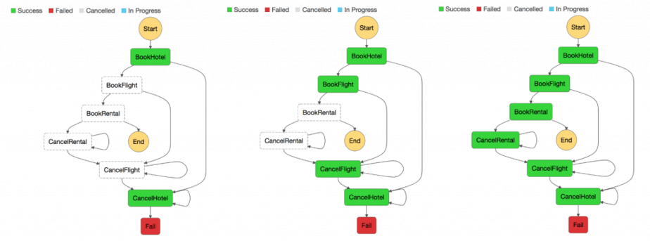

La creazione di un archivio centralizzato di dati di riferimento critici curati da strumenti e procedure di gestione dei dati master fornisce un mezzo per i microservizi per sincronizzare i dati critici e, eventualmente, eseguire il rollback dello stato. Utilizzando Lambda con Amazon CloudWatch Events pianificati è possibile creare un semplice meccanismo di pulizia e deduplicazione.

È molto comune che le modifiche di stato influiscano su più di un singolo microservizio. In questi casi, l'approvvigionamento di eventi ha dimostrato di essere un modello utile. L'idea principale alla base del sourcing degli eventi è quella di rappresentare e mantenere ogni modifica dell'applicazione come record di eventi. Invece di persistere dello stato dell'applicazione, i dati vengono memorizzati come flusso di eventi. I sistemi di registrazione delle transazioni del database e di controllo della versione sono due esempi noti per il sourcing degli eventi. L'approvvigionamento degli eventi ha un paio di vantaggi: lo stato può essere determinato e ricostruito per qualsiasi point-in-time. Produce naturalmente un audit trail persistente e facilita anche il debug.

Nel contesto delle architetture di microservizi, l'origine degli eventi consente di disaccoppiare diverse parti di un'applicazione utilizzando un modello di pubblicazione/sottoscrizione e alimenta gli stessi dati degli eventi in modelli di dati diversi per microservizi separati. L'origine eventi viene spesso utilizzata in combinazione con il modello CQRS (Command Query Responsibility Segregation) per disaccoppiare la lettura dai carichi di lavoro di scrittura e ottimizzare sia per prestazioni, scalabilità e sicurezza. Nei sistemi di gestione dei dati tradizionali, i comandi e le query vengono eseguiti sullo stesso repository di dati.

La figura seguente mostra come il modello di sourcing degli eventi può essere implementato in AWS. [Amazon Kinesis Data Streams](https://aws.amazon.com/it/kinesis/data-streams/) funge da componente principale dell'archivio eventi centrale, che acquisisce le modifiche delle applicazioni come eventi e le mantiene su Amazon S3.

La figura seguente illustra tre diversi microservizi composti da Amazon API Gateway, AWS Lambda e Amazon DynamoDB. Le frecce blu indicano il flusso degli eventi: quando microservice 1 subisce una modifica dello stato dell'evento, pubblica un evento scrivendo un messaggio in Kinesis Data Streams. Tutti i microservizi eseguono la propria applicazione Kinesis Data Streams in AWS Lambda che legge una copia del messaggio, lo filtra in base alla rilevanza per il microservizio, ed eventualmente lo inoltra per ulteriori elaborazioni.

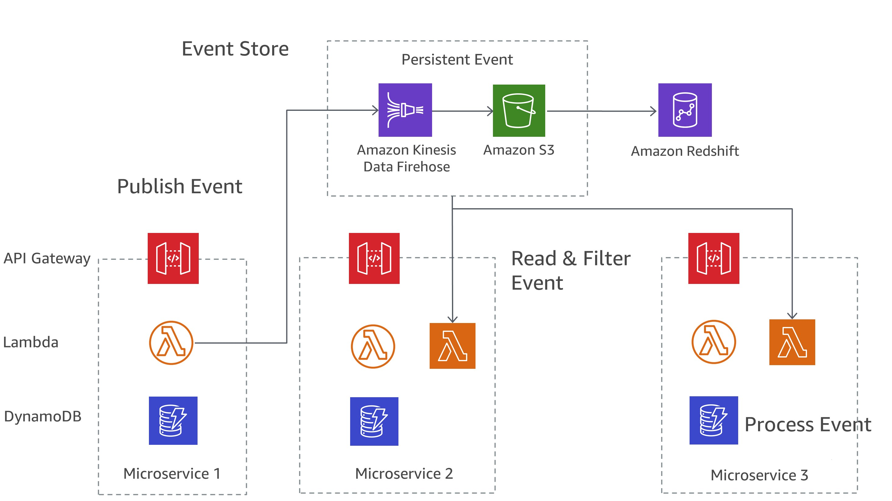

Amazon S3 memorizza in modo duraturo tutti gli eventi in tutti i microservizi ed è l'unica fonte di verità quando si tratta di debug, ripristino dello stato dell'applicazione o controllo delle modifiche alle applicazioni.

### Comunicazione asincrona e messaggistica leggera

La comunicazione nelle applicazioni monolitiche tradizionali è semplice: una parte dell'applicazione utilizza chiamate al metodo o un meccanismo di distribuzione degli eventi interno per comunicare con le altre parti. Se la stessa applicazione viene implementata utilizzando microservizi disaccoppiati, la comunicazione tra le diverse parti dell'applicazione deve essere implementata utilizzando la comunicazione di rete.

#### Comunicazione basata su REST

Il protocollo HTTP/S è il modo più popolare per implementare la comunicazione sincrona tra microservizi. Nella maggior parte dei casi, le API RESTful utilizzano HTTP come livello di trasporto. Lo stile architettonico REST si basa su comunicazione stateless, interfacce uniformi e metodi standard.

Con API Gateway è possibile creare un'API che funge da «front door» per le applicazioni per accedere a dati, business logic o funzionalità dai servizi back-end, come carichi di lavoro in esecuzione su Amazon EC2 e Amazon ECS, codice in esecuzione su Lambda o qualsiasi applicazione Web. Un oggetto API definito con il servizio Gateway API è un gruppo di risorse e metodi. Una risorsa è un oggetto digitato all'interno del dominio di un'API e può aver associato un modello di dati o relazioni ad altre risorse. Ogni risorsa può essere configurata per rispondere a uno o più metodi, ovvero verbi HTTP standard come GET, POST o PUT. Le API REST possono essere distribuite in diverse fasi, versioni e clonate in nuove versioni.

API Gateway gestisce tutte le attività necessarie per accettare ed elaborare fino a centinaia di migliaia di chiamate API simultanee, tra cui la gestione del traffico, il controllo delle autorizzazioni e degli accessi, il monitoraggio e la gestione delle versioni API.

#### Messaggistica asincrona e passaggio di eventi

Un modello aggiuntivo per implementare la comunicazione tra microservizi è il passaggio dei messaggi. I servizi comunicano scambiando messaggi tramite una coda. Uno dei principali vantaggi di questo stile di comunicazione è che non è necessario avere un servizio discovery e servizi sono liberamente coppia. I sistemi sincroni sono strettamente accoppiati, il che significa che un problema in una dipendenza sincrona a valle ha un impatto immediato sui chiamanti a monte. I tentativi da parte dei chiamanti upstream possono rapidamente fan-out e amplificare i problemi.

A seconda dei requisiti specifici, come i protocolli, AWS offre diversi servizi che aiutano a implementare questo modello. Una possibile implementazione utilizza una combinazione di [Amazon Simple Queue Service (Amazon SQS)](https://aws.amazon.com/it/sqs/) e [Amazon Simple Notification Service (Amazon SNS)](https://aws.amazon.com/it/sns/).

Entrambi i servizi lavorano a stretto contatto: Amazon SNS consente alle applicazioni di inviare messaggi a più abbonati tramite un meccanismo push. Utilizzando Amazon SNS e Amazon SQS insieme, un messaggio può essere recapitato a più consumatori. La figura 7 illustra l'integrazione di Amazon SNS e Amazon SQS.

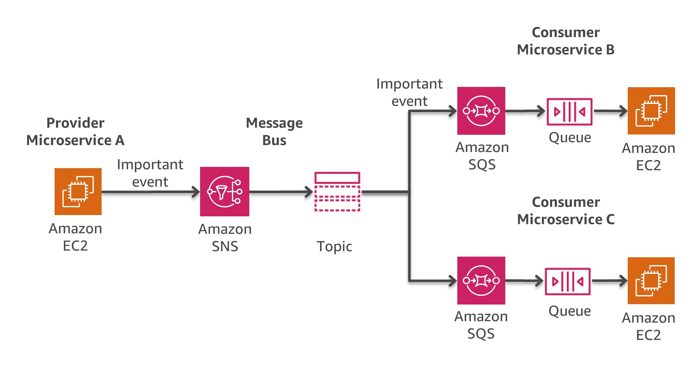

Quando sottoscrivi una coda SQS a un argomento SNS, puoi pubblicare un messaggio sull'argomento e Amazon SNS invia un messaggio alla coda SQS sottoscritta. Il messaggio contiene oggetto e messaggio pubblicati sull'argomento insieme alle informazioni sui metadati in formato JSON.

Una strategia di implementazione diversa si basa su [Amazon MQ](https://aws.amazon.com/it/amazon-mq/), che può essere utilizzata se il software esistente utilizza API e protocolli standard aperti per la messaggistica, tra cui JMS, NMS, AMQP, STOMP, MQTT e WebSocket. Amazon SQS espone un'API personalizzata, il che significa che se si dispone di un'applicazione esistente che si desidera migrare da, ad esempio, un ambiente locale a AWS, sono necessarie modifiche al codice. Con Amazon MQ questo non è necessario in molti casi.

Amazon MQ gestisce l'amministrazione e la manutenzione di ActiveMQ, un popolare broker di messaggi open source. L'infrastruttura sottostante viene automaticamente eseguito il provisioning per garantire la disponibilità elevata e la durata dei messaggi per supportare l'affidabilità delle applicazioni.

#### Orchestrazione e gestione dello stato

Il carattere distribuito dei microservizi rende difficile orchestrare i flussi di lavoro quando sono coinvolti più microservizi. Gli sviluppatori potrebbero essere tentati di aggiungere direttamente il codice di orchestrazione nei loro servizi. Questo dovrebbe essere evitato in quanto introduce un accoppiamento più stretto e rende più difficile sostituire rapidamente i singoli servizi.

È possibile utilizzare le funzioni passo per creare applicazioni da singoli componenti che eseguono ciascuna una funzione discreta. Step Functions fornisce una macchina a stato che nasconde le complessità dell'orchestrazione del servizio, come la gestione degli errori e serializzazione/parallelizzazione. Ciò consente di ridimensionare e modificare rapidamente le applicazioni evitando ulteriori codici di coordinamento all'interno dei servizi.

Step Functions è un modo affidabile per coordinare i componenti e passare attraverso le funzioni dell'applicazione. Step Functions fornisce una console grafica per organizzare e visualizzare i componenti dell'applicazione come una serie di passaggi. In questo modo è semplice creare ed eseguire servizi distribuiti. Step Functions attiva automaticamente e tiene traccia di ogni passo e riprova quando ci sono errori, in modo che l'applicazione venga eseguita in ordine e come previsto. Step Functions registra lo stato di ogni passaggio in modo che quando qualcosa va storto, è possibile diagnosticare ed eseguire il debug rapidamente dei problemi. Puoi modificare e aggiungere passaggi senza nemmeno scrivere codice per far evolvere la tua applicazione e innovare più velocemente.

Step Functions fa parte della piattaforma serverless AWS e supporta l'orchestrazione di funzioni Lambda e applicazioni basate su risorse di calcolo, come Amazon EC2 e Amazon ECS, e servizi aggiuntivi come [Amazon SageMaker](https://aws.amazon.com/it/sagemaker/) e [AWS Glue](https://aws.amazon.com/it/glue/). Figura 8 illustra come le invocazioni delle funzioni Lambda vengono spinte direttamente da Step Functions a Lambda, mentre i lavoratori su Amazon EC2 o Amazon ECS eseguono continuamente il sondaggio per le chiamate.

Step Functions gestisce le operazioni e l'infrastruttura sottostante per garantire che l'applicazione sia disponibile su qualsiasi scala.

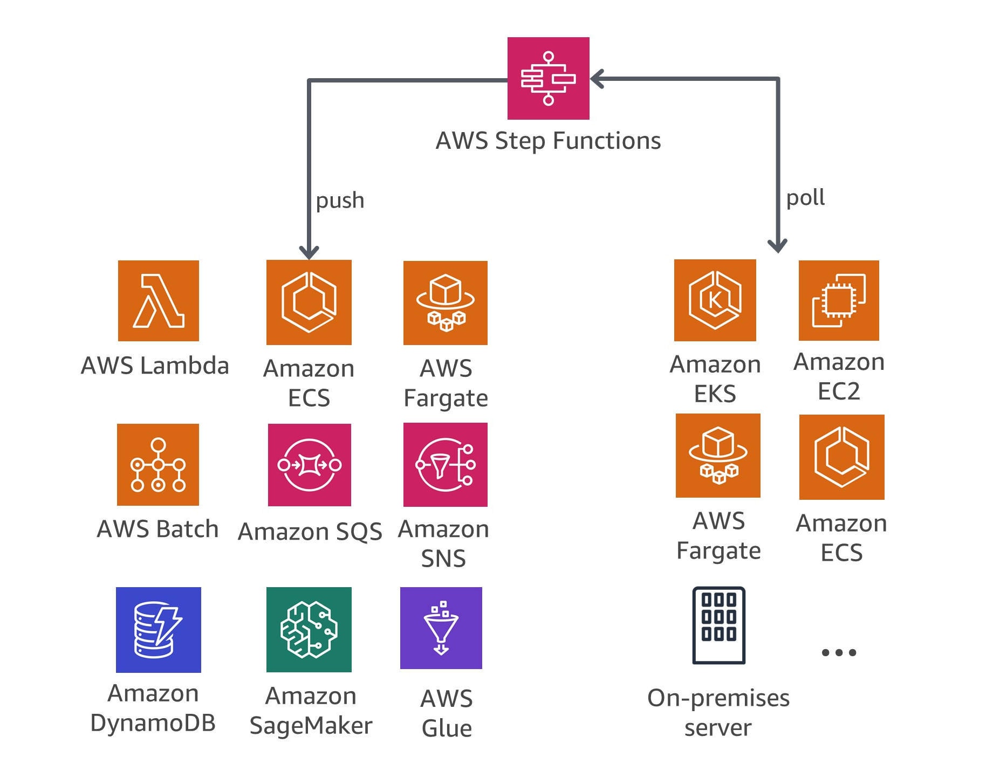

Per creare flussi di lavoro, Step Functions utilizza la lingua Amazon States. I flussi di lavoro possono contenere passi sequenziali o paralleli, nonché passaggi di ramificazione.

La figura seguente mostra un flusso di lavoro di esempio per un'architettura di microservizi che combina passaggi sequenziali e paralleli. L'invocazione di tale flusso di lavoro può essere eseguita tramite l'API Funzioni passo o con il gateway API.

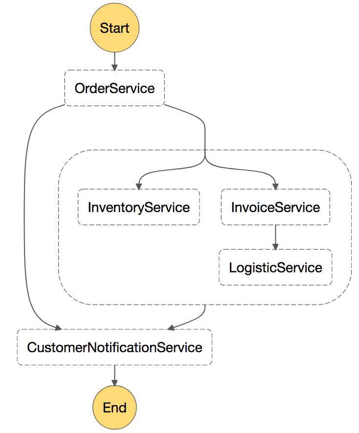

### Monitoring distribuito di microservizi

Un'architettura a microservizi è costituita da molte parti distribuite che devono essere monitorate.

Puoi utilizzare [Amazon CloudWatch](https://aws.amazon.com/it/cloudwatch/) per raccogliere e tenere traccia delle metriche, centralizzare e monitorare i file di registro, impostare allarmi e reagire automaticamente alle modifiche apportate all'ambiente AWS. CloudWatch è in grado di monitorare le risorse AWS come istanze EC2, tabelle DynamoDB e istanze di DB RDS, nonché le metriche personalizzate generate dalle applicazioni e dai servizi e tutti i file di registro generati dalle applicazioni.

#### Monitoring

È possibile utilizzare CloudWatch per ottenere visibilità a livello di sistema sull'utilizzo delle risorse, sulle prestazioni delle applicazioni e sullo stato operativo. CloudWatch offre una soluzione di monitoraggio affidabile, scalabile e flessibile che puoi iniziare a utilizzare in pochi minuti. Non è più necessario configurare, gestire e scalare i propri sistemi di monitoraggio e l'infrastruttura. In un'architettura di microservizi, la capacità di monitorare le metriche personalizzate utilizzando CloudWatch è un vantaggio aggiuntivo perché gli sviluppatori possono decidere quali metriche devono essere raccolte per ciascun servizio. Inoltre, il ridimensionamento dinamico può essere implementato in base a metriche personalizzate.

Un'altra opzione popolare, soprattutto per Amazon EK, è quella di utilizzare Prometheus. Prometheus è un toolkit di monitoraggio e avvisi open source che viene spesso utilizzato in combinazione con Grafana per visualizzare le metriche raccolte. Molti componenti Kubernetes memorizzano le metriche in `/metrics` e Prometheus può raschiare queste metriche a intervalli regolari.

#### Centralizzare i logs

Avere dei logs coerenti è fondamentale per la risoluzione dei problemi e l'identificazione dei problemi. I microservizi consentono ai team di spedire molte più versioni che mai prima e incoraggiano i team di progettazione a eseguire esperimenti su nuove funzionalità in produzione. Comprendere l'impatto dei clienti è fondamentale per migliorare gradualmente un'applicazione.

La maggior parte dei servizi AWS centralizza i file di log per impostazione predefinita. Le destinazioni principali per i file di log su AWS sono Amazon S3 e Amazon CloudWatch Log. Per le applicazioni in esecuzione su istanze EC2, è disponibile un demone per inviare file di log a CloudWatch Logs. Le funzioni Lambda inviano nativamente il loro output di log a CloudWatch Logs e Amazon ECS include il supporto per il driver di log awslogs che consente la centralizzazione dei log del contenitore ai log di CloudWatch. Per Amazon EKS, è necessario eseguire FluentD che inoltra i log dalle singole istanze del cluster ad un logging centralizzato di CloudWatch Logs in cui sono combinati per report di livello superiore utilizzando Elasticsearch e Kibana.

La figura seguente illustra le funzionalità di logging di alcuni servizi. I team sono quindi in grado di cercare e analizzare questi log utilizzando strumenti come [Amazon Elasticsearch Service (Amazon ES)](https://aws.amazon.com/it/elasticsearch-service/) e Kibana. [Amazon Athena](https://aws.amazon.com/it/athena/) può essere utilizzato per eseguire query ad hoc su file di log centralizzati in Amazon S3.

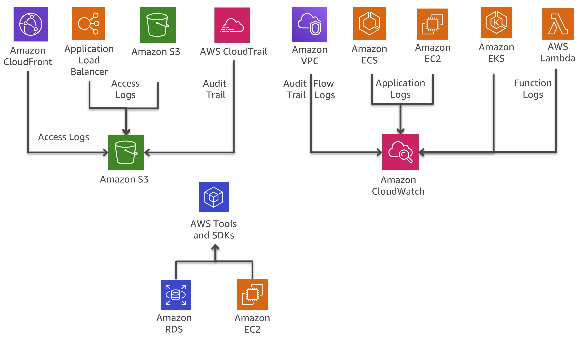

#### Tracciamento distribuito

In molti casi, un insieme di microservizi lavora insieme per gestire una richiesta. Immagina un sistema complesso costituito da decine di microservizi in cui si verifica un errore in uno dei servizi nella catena di chiamate. Anche se ogni microservizio registra correttamente e i registri vengono consolidati in un sistema centrale, può essere difficile trovare tutti i messaggi di log pertinenti.

L'idea centrale alla base di [AWS X-Ray](https://aws.amazon.com/it/xray/) è l'uso di ID di correlazione, che sono identificatori univoci collegati a tutte le richieste e messaggi relativi a una catena di eventi specifica. L'ID di traccia viene aggiunto alle richieste HTTP in intestazioni di traccia specifiche denominate X-Amzn-Trace-Id quando la richiesta raggiunge il primo servizio X-Ray-integrato (ad esempio, Application Load Balancer o API Gateway) e incluso nella risposta. Tramite X-Ray SDK, qualsiasi microservizio può leggere ma può anche aggiungere o aggiornare questa intestazione.

AWS X-Ray funziona con Amazon EC2, Amazon ECS, Lambda e [AWS Elastic Beanstalk](https://aws.amazon.com/it/elasticbeanstalk/). È possibile utilizzare X-Ray con applicazioni scritte in Java, Node.js ed NET distribuite in questi servizi.

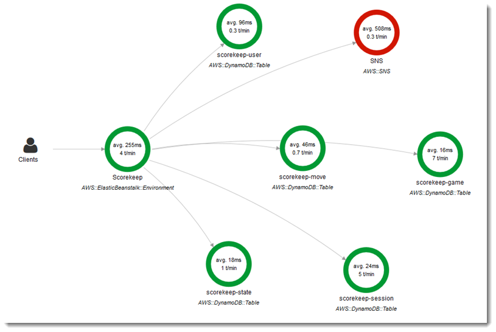

#### Opzioni per l'analisi dei log su AWS

La ricerca, l'analisi e la visualizzazione dei dati di log è un aspetto importante della comprensione dei sistemi distribuiti. Amazon CloudWatch Log Insights è un ottimo servizio per esplorare, analizzare e visualizzare i tuoi log istantaneamente. Ciò consente di risolvere i problemi operativi. Un'altra opzione per analizzare i file di registro consiste nell'utilizzare Amazon ES insieme a Kibana.

Amazon ES può essere utilizzato per la ricerca full-text, la ricerca strutturata, l'analisi e tutti e tre in combinazione. Kibana è un plugin di visualizzazione dei dati open source per Amazon ES che si integra perfettamente con esso.

La figura seguente illustra l'analisi dei log con Amazon ES e Kibana. I log di CloudWatch possono essere configurati per trasmettere le voci di log ad Amazon ES quasi in tempo reale attraverso un abbonamento CloudWatch Log. Kibana visualizza i dati ed espone una comoda interfaccia di ricerca ai data store in Amazon ES. Questa soluzione può essere utilizzata in combinazione con software come [ElastAlert](https://github.com/Yelp/elastalert) per implementare un sistema di allarme al fine di inviare notifiche SNS, e-mail, creare biglietti JIRA, ecc, se anomalie, picchi, o altri modelli di interesse sono rilevati nei dati.

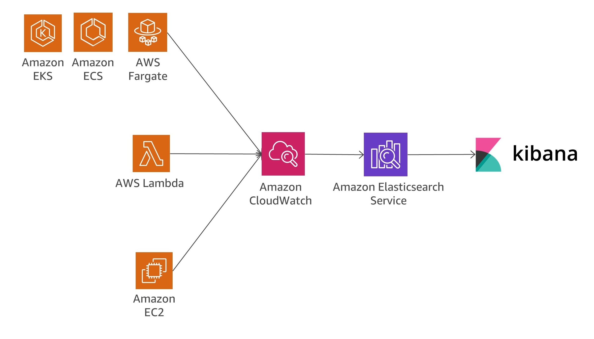

Un'altra opzione per analizzare i file di registro consiste nell'utilizzare [Amazon Redshift](https://aws.amazon.com/it/redshift/) insieme ad [Amazon QuickSight](https://aws.amazon.com/it/quicksight/).

Amazon QuickSight può essere facilmente collegato ai servizi dati AWS, tra cui Amazon Redshift, Amazon RDS, Amazon Aurora, Amazon EMR, Amazon DynamoDB, Amazon S3 e Amazon Kinesis.

I log di Amazon CloudWatch possono fungere da archivio centralizzato per i dati di log e, oltre a memorizzare solo i dati, è possibile eseguire lo streaming delle voci di log su Amazon Kinesis Data Firehose.

La figura seguente illustra uno scenario in cui le voci dei log vengono trasmesse da diverse origini ad Amazon Redshift utilizzando CloudWatch Logs e Kinesis Data Firehose. Amazon QuickSight utilizza i dati archiviati in Amazon Redshift per l'analisi, la creazione di report e la visualizzazione.

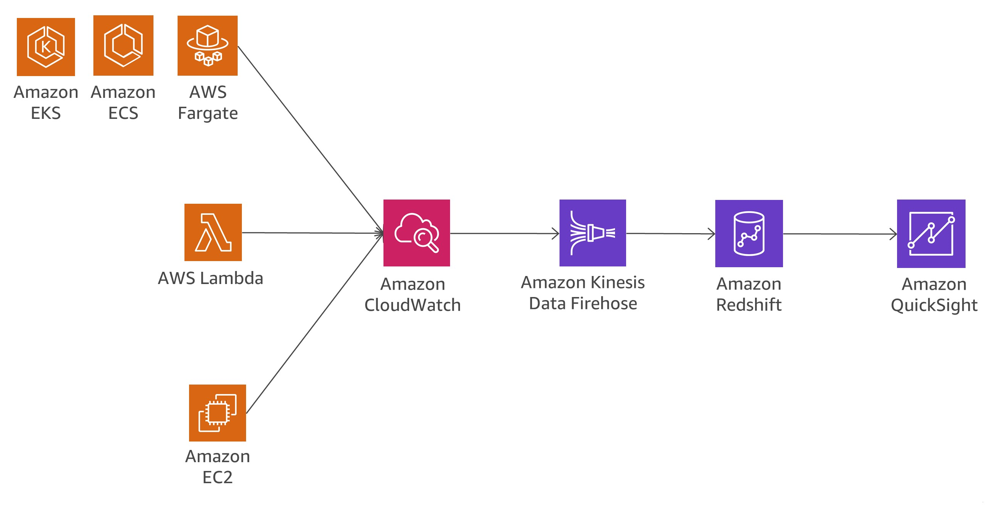

La figura seguente illustra uno scenario di analisi dei log su Amazon S3. Quando i log sono memorizzati in bucket S3, i dati di log possono essere caricati in diversi servizi dati AWS, come Amazon Redshift o Amazon EMR, per analizzare i dati memorizzati nel flusso di log e trovare anomalie.

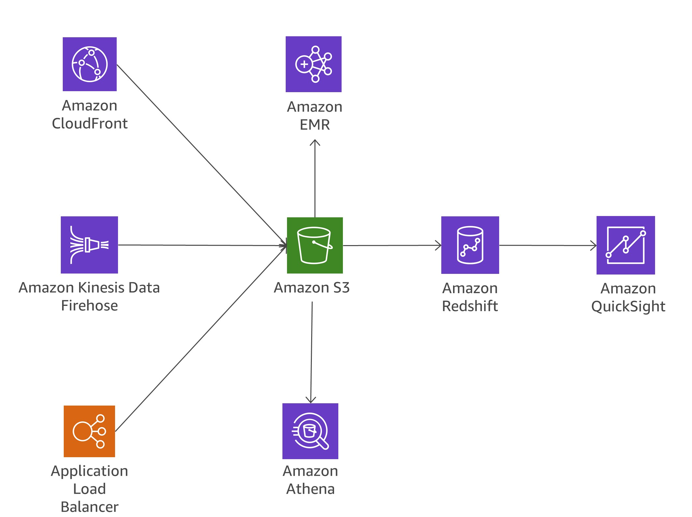

### Sovraccarico dovuto ai sistemi di messaging

Rompendo le applicazioni monolitiche in piccoli microservizi, il sovraccarico di comunicazione aumenta perché i microservizi devono parlare tra loro. In molte implementazioni, REST su HTTP viene utilizzato perché è un protocollo di comunicazione leggero, ma volumi elevati di messaggi possono causare problemi. In alcuni casi, si potrebbe considerare di consolidare i servizi che inviano molti messaggi avanti e indietro. Se ti trovi in una situazione in cui consolidi sempre più servizi solo per ridurre questo sovraccarico, occorre rivedere i domini problematici e il modello di dominio.

#### Protocolli

In precedenza in questo white paper, nella sezione "Comunicazione asincrona e Messaggistica leggera", vengono discussi diversi protocolli possibili. Per i microservizi è comune usare protocolli semplici come HTTP. I messaggi scambiati dai servizi possono essere codificati in modi diversi, ad esempio formati leggibili come JSON o YAML, o formati binari efficienti come Avro o Protocol Buffer.

#### Caching

Le cache sono un ottimo modo per ridurre la latenza ed il sovraccarico dovuto ai sistemi di messaging nelle architetture di microservizi. Sono possibili diversi livelli di memorizzazione nella cache, a seconda del caso d'uso effettivo e dei colli di bottiglia. Molte applicazioni di microservizi in esecuzione su AWS utilizzano Amazon Elasticache per ridurre il volume delle chiamate ad altri microservizi memorizzando nella cache i risultati localmente. API Gateway fornisce un livello di memorizzazione nella cache incorporato per ridurre il carico sui server back-end. Inoltre, la memorizzazione nella cache è utile anche per ridurre il carico dal livello di persistenza dei dati. La sfida per qualsiasi meccanismo di memorizzazione nella cache consiste nel trovare il giusto equilibrio tra una buona velocità di accesso alla cache e la tempestività e la coerenza dei dati.

### Auditing

Un'altra sfida da affrontare nelle architetture di microservizi, che possono potenzialmente avere centinaia di servizi distribuiti, consiste nel garantire la visibilità delle azioni degli utenti su ciascun servizio e nell'essere in grado di ottenere una buona visione generale su tutti i servizi a livello organizzativo. Per facilitare l'applicazione dei criteri di sicurezza, è importante controllare sia l'accesso alle risorse che le attività che portano a modifiche del sistema.

Le modifiche devono essere monitorate a livello di servizio individuale e tra i servizi in esecuzione su un sistema più ampio. In genere, le modifiche si verificano frequentemente nelle architetture di microservizi, il che rende le modifiche di controllo ancora più importanti. In questa sezione vengono esaminati i servizi e le funzionalità chiave all'interno di AWS che consentono di controllare l'architettura dei microservizi.

#### Audit Trail

[AWS CloudTrail](https://aws.amazon.com/it/cloudtrail/) è uno strumento utile per monitorare le modifiche nei microservizi perché consente di registrare e inviare tutte le chiamate API effettuate nel Cloud AWS a Log CloudWatch in tempo reale o ad Amazon S3 in pochi minuti.

Tutte le azioni degli utenti e dei sistemi automatizzati diventano ricercabili e possono essere analizzate per individuare comportamenti imprevisti, violazioni dei criteri aziendali o debug. Le informazioni registrate includono un timestamp, informazioni utente/account, il servizio che è stato chiamato, l'azione di servizio richiesta, l'indirizzo IP del chiamante, nonché parametri di richiesta e elementi di risposta.

CloudTrail consente la definizione di percorsi multipli per lo stesso account, consentendo a diversi stakeholder, come amministratori di sicurezza, sviluppatori software o auditor IT, di creare e gestire il proprio percorso. Se i team di microservice hanno account AWS diversi, è possibile aggregare i trail in un singolo bucket S3.

I vantaggi dell'archiviazione degli audit trail in CloudWatch sono che i dati di audit trail vengono acquisiti in tempo reale ed è facile reindirizzare le informazioni ad Amazon ES per la ricerca e la visualizzazione. Puoi configurare CloudTrail per accedere a entrambi i log di Amazon S3 e CloudWatch.

#### Eventi e azioni in tempo reale

Alcuni cambiamenti nelle architetture di sistema devono essere risolti rapidamente e devono essere avviate le azioni intraprese per rimediare alla situazione, oppure procedure di governance specifiche per autorizzare la modifica.

L'integrazione di CloudWatch Events con CloudTrail consente di generare eventi per tutte le chiamate API mutanti su tutti i servizi AWS. È anche possibile definire eventi personalizzati o generare eventi in base a una pianificazione fissa.

Quando un evento viene attivato e corrisponde a una regola definita, le persone giuste dell'organizzazione possono essere avvisate immediatamente, consentendo loro di intraprendere le azioni appropriate. Se l'azione richiesta può essere automatizzata, la regola può attivare automaticamente un flusso di lavoro incorporato o richiamare una funzione Lambda per risolvere il problema.

La Figura 15 mostra un ambiente in cui CloudTrail e CloudWatch Events collaborano per soddisfare i requisiti di verifica e correzione all'interno di un'architettura di microservizi. Tutti i microservizi vengono monitorati da CloudTrail e l'audit trail viene memorizzato in un bucket S3. Gli eventi CloudWatch si posizionano sopra CloudTrail e attivano gli avvisi quando viene apportata una modifica specifica alla tua architettura.

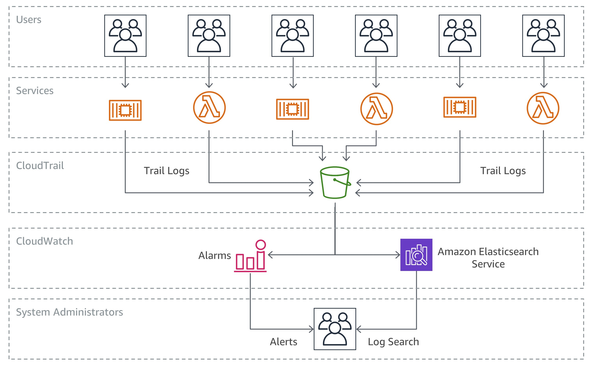

#### Inventario risorse e gestione delle modifiche

Per mantenere il controllo sulle configurazioni dell'infrastruttura in rapida evoluzione in un ambiente di sviluppo agile, è essenziale disporre di un approccio più automatizzato e gestito all'auditing e al controllo dell'architettura.

Mentre gli eventi CloudTrail e CloudWatch sono elementi costitutivi importanti per tenere traccia e rispondere alle modifiche dell'infrastruttura nei microservizi, le regole di [AWS Config](https://aws.amazon.com/it/config/) consentono a un'azienda di definire criteri di sicurezza con regole specifiche per rilevare automaticamente, tenere traccia e avvisare l'utente in caso di violazioni delle policy.

L'esempio seguente illustra come sia possibile rilevare, informare e reagire automaticamente alle modifiche di configurazione non conformi all'interno dell'architettura dei microservizi. Un membro del team di sviluppo ha apportato una modifica al gateway API per un microservizio per consentire all'endpoint di accettare il traffico HTTP in ingresso, anziché consentire solo le richieste HTTPS. Poiché questa situazione è stata precedentemente identificata come un problema di conformità alla sicurezza dall'organizzazione, una regola di configurazione AWS sta già monitorando questa condizione.

La regola identificherà la modifica come violazione di protezione ed esegue due azioni: crea un log della modifica rilevata in un bucket S3 per il controllo e crea una notifica SNS. Amazon SNS viene utilizzato per due scopi nel nostro scenario: inviare un'e-mail a un gruppo specificato per informare sulla violazione della sicurezza e aggiungere un messaggio a una coda SQS. Successivamente, il messaggio viene raccolto e lo stato conforme viene ripristinato modificando la configurazione del gateway API.

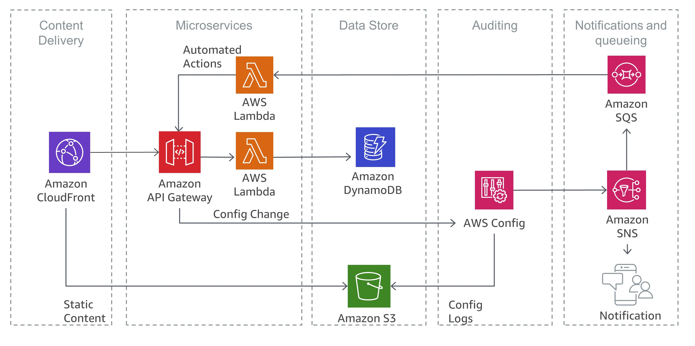

 

----------

 

## Conclusione

Un architettura a microservizi è un approccio progettuale distribuito destinato a superare i limiti delle architetture monolitiche tradizionali. I microservizi aiutano a scalare applicazioni e organizzazioni migliorando al contempo i tempi di ciclo. Tuttavia, presentano anche un paio di sfide che potrebbero aggiungere ulteriore complessità architettonica e oneri operativi.

AWS offre un ampio portafoglio di servizi gestiti che possono aiutare i team di prodotto a creare architetture di microservizi e ridurre al minimo la complessità architettonica e operativa. Questo white paper guida l'utente attraverso i servizi AWS pertinenti e come implementare modelli tipici, come l'individuazione dei servizi o il sourcing degli eventi, in modo nativo con i servizi AWS.

 

----------

 

## Risorse

- [AWS Architecture Center](https://aws.amazon.com/architecture/?icmpid=link_from_docs_website)
- [AWS Whitepapers](https://aws.amazon.com/whitepapers/?icmpid=link_from_docs_website)
- [AWS Architecture Monthly](https://aws.amazon.com/whitepapers/kindle/?icmpid=link_from_docs_website)
- [AWS Architecture Blog](https://aws.amazon.com/blogs/architecture/?icmpid=link_from_docs_website)
- [This Is My Architecture videos](https://aws.amazon.com/this-is-my-architecture/?icmpid=link_from_docs_website)
- [AWS Answers](https://aws.amazon.com/answers/?icmpid=link_from_docs_website)
- [AWS Documentation](https://aws.amazon.com/documentation/)